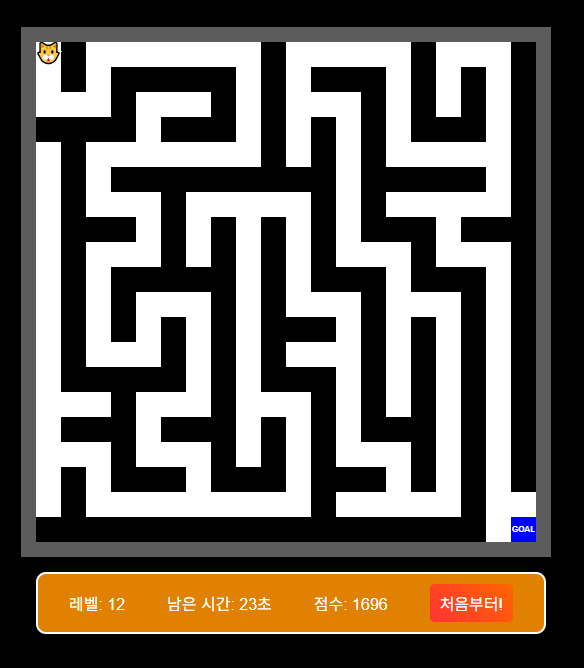

# 🏆 미로 탈출 게임 (Maze Escape Game)

방향키를 사용하여 목표 지점까지 이동하여 미로를 탈출하는 간단한 웹 게임.    
빠르게 도착할수록 더 높은 점수 획득 가능.  
<br>
***[미로게임하러가기 Click!](https://carpe-horas.github.io/Maze-Escape-Game/)***


<br>

## 사용된 로직 및 알고리즘
### 1. 미로 생성 - 깊이 우선 탐색(DFS, Depth-First Search) 알고리즘
- 스택을 이용해 탐색
-  현재 위치에서 네 방향을 무작위로 선택하고 미로벽 유지를 위해 두 칸씩 건너뛰며 탐색
- 이동할 때마다 벽을 하나 제거하여 새로운 길을 만듦 
- 모든 탐색이 완료되면 미로가 완성되며 매번 새로운 미로가 생성
### 2. 플레이어 이동 및 충돌 검사
- 방향키 입력 시 플레이어의 새로운 좌표 계산
- 이동할 위치가 벽인지 확인하고 벽이 아닌 경우에만 이동 가능
### 3. 목표 지점 접근 가능 여부 보장
- 미로가 생성된 후 목표 지점이 벽으로 둘러싸여 도달할 수 없는 경우 방지
- 목표 지점 근처의 벽을 제거하여 항상 도달할 수 있도록 조정
### 4. 점수 시스템
- 플레이어가 목표 지점에 도달할 때 점수를 계산하여 추가
- 현재 레벨과 남은 시간을 기준으로 점수 산정
- 레벨이 올라가면 추가 점수도 증가
### 5. 캔버스를 활용한 미로 및 플레이어 표시
- HTML5 Canvas API를 사용하여 미로, 플레이어, 목표 지점을 그림
- 플레이어는 흰색 타일을 사용하고 이모지로 표현  
<br>

## 기술 스택
- HTML, CSS, JavaScript  
<br>

## 📂 **폴더 구조**
```plaintext
📂 maze-game
 ├── 📂 assets
 │   ┗─ 🖼️ maze.jpg     # 배경 이미지
 ├── 📂 css
 │   ├─ 📄 index.css
 │   ┗─ 📄 game.css
 ├── 📄 game.js         # 게임 로직
 ├── 📄 index.html      # 게임 시작 화면
 ├── 📄 game.html       # 게임 플레이 화면
 ┗── 📄 README.md
```
